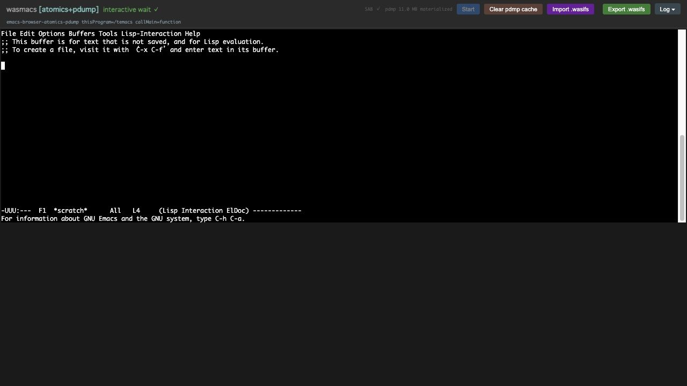
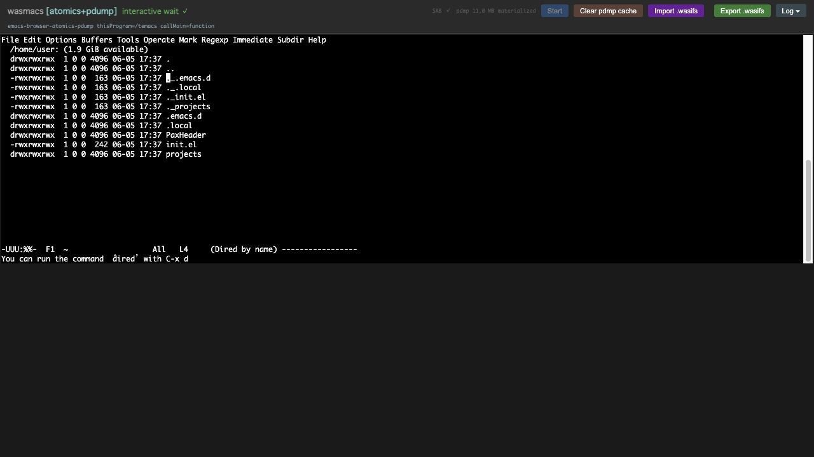
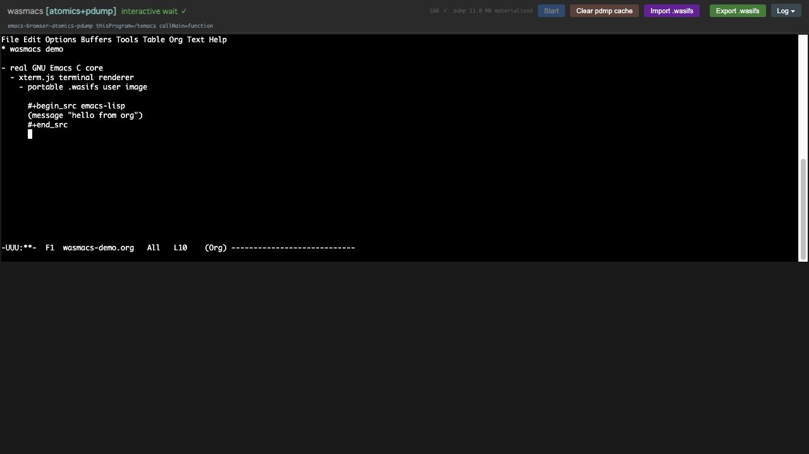

# wasmacs

`wasmacs` is a browser-hosted GNU Emacs experiment. The project keeps the real
Emacs C core and Elisp runtime as the center of gravity, then hosts display,
input, persistence, and portable filesystem images in the browser.

## Repository Layout

```text
src/wasm/   browser wasm app source
src/assets/ source assets copied into generated docs output
src/build/  docs and generated artifact build scripts
src/c/      Emacs C-side patch layer
src/runtime/ host/runtime libraries used by tests and tools
tools/      build, validation, probe, prototype, and inspection tools
tools/probs/ prototype and exploratory probe code
proxy/      optional self-hosted fetch proxy samples for package archives
vendor/     pinned upstream GNU Emacs source, read-only
build/      copied Emacs working trees, temporary state, and generated artifacts
build/artifacts/ generated wasm, pdmp, and wasifs build products
build2/     VS Code-only copied Emacs workspaces and generated runtime artifacts
doc/        architecture and planning notes
docs/       GitHub Pages output
vscode/     generated VS Code webview app bundle
logs/       ignored runtime logs; keep only .gitkeep in Git
tests/      automated test code
archive/    old outputs and superseded files
```

The current browser app is the Atomics/pdump xterm route. During development it
is available at:

```text
http://127.0.0.1:5173/app/xterm-atomics-pdump.html
```

`make docs` also writes the GitHub Pages bundle. `docs/index.html` redirects
`/` to the canonical app page at `/app/xterm-atomics-pdump.html`. The published
route is expected to boot to `interactive` with `SharedArrayBuffer`, the bundled
`bootstrap-emacs.pdmp`, xterm.js rendering, and import/export for
`user-filesystem.wasifs`.

The Pages artifact policy is deliberately split: build outputs are generated
under `build/artifacts/`, while the publishable `docs/` tree includes only the
checked-in browser bundle and Pages-safe runtime artifacts. The large
Emscripten preload package is stored as `temacs.data.parts/` chunks under
`docs/artifacts/` instead of a single oversized `temacs.data` file.

The VS Code `.wasifs` extension uses a separate generated lane. `make
vscode-build` writes VS Code-only runtime artifacts under `build2/artifacts/`
and a webview app bundle under `vscode/app/`; it does not consume or update
`docs/app` or `docs/artifacts`. This keeps the docs/Pages build reproducible
from `build/` and `docs/` even when VS Code experiments are present.

The Pages bundle uses a root `coi-serviceworker.js` to emulate COOP/COEP for
`SharedArrayBuffer`, keeps app and artifact URLs relative so project pages work
under `/repo-name/`, and publishes the Emscripten glue as `temacs.js` so static
servers return a JavaScript MIME type.

The browser terminal profile is `TERM=xterm-256color` with truecolor output,
xterm mouse mode, cursor and control-key transport, bracketed-paste
normalization, and responsive terminal resize. Routine diagnostic logs are
quiet by default; append `?debug-log=1` to show verbose worker/runtime logs.
For DevTools sessions that resize the viewport, append `?no-live-resize=1` to
keep the post-boot terminal size stable while inspecting the page.

## Browser Screenshots

These screenshots were captured from the generated `docs/` bundle served
locally with COOP/COEP headers.

### Startup



### Dired



### Org File



## Requirements

- Node.js 24 or newer.
- npm, used for the `npm` scripts that back `make test` and `make dev`.

xterm.js is intentionally loaded from the jsDelivr CDN by the browser pages, not
vendored through `node_modules`. The checked-in HTML references
`https://cdn.jsdelivr.net/npm/@xterm/xterm@5/...` directly.

After cloning, run:

```sh
npm ci
```

## Network Access

wasmacs treats network access as an explicit browser-host capability. The Emacs
core does not get raw sockets or `host.process` for package downloads. Instead,
the checked-in `wasmacs-url-fetch` Lisp overlay routes `url.el` HTTP(S)
requests through `host.network.fetch`, so `package-refresh-contents`,
`package-install`, and `use-package :ensure` can use a request/response service
without pretending that browser JavaScript is a POSIX network stack.

Direct browser `fetch` works only when the remote package archive permits the
page origin with CORS. Many package archive endpoints do not. Service Workers
can help with app caching and COOP/COEP, but they cannot make an unreadable
cross-origin response readable to JavaScript.

When an archive is blocked by CORS, users can configure a self-hosted fetch
proxy under their own control. wasmacs does not provide a central proxy service.
The repository includes sample implementations in `proxy/` for Node, PHP, Go,
Rust, Perl, Ruby, Python, and PowerShell. Each sample accepts the same JSON
request shape as the local development `__wasmacs_network_fetch` route and
returns status, headers, and base64 response bytes.

The samples are intentionally allowlist-based. Set
`WASMACS_PROXY_ALLOWED_ORIGINS` to the archive origins you are willing to fetch:

```sh
WASMACS_PROXY_ALLOWED_ORIGINS=https://elpa.gnu.org,https://melpa.org
```

This is a user-operated network gateway, not a hidden project service. The
operator is responsible for hosting policy, access control, logging, and the
set of allowed archive origins. See `proxy/README.md` for the runnable examples.
The Python and PowerShell samples are the most likely cross-platform local
fallbacks: Python 3 is common on macOS/Linux developer machines, while
PowerShell is the native Windows path.

## Common Commands

```sh
make prepare
make test
make build
make vscode-build
make docs
make dev
```

`make prepare` copies `vendor/emacs` into `build/emacs-30.2-patched/src` and
applies `src/c/patches/*.patch`. Do not edit `vendor/emacs` directly.

## wasifs Images

`.wasifs` files are the portable filesystem images used by the browser runtime.
The current spike format is tar-compatible, so `tar tf image.wasifs` remains a
valid low-level inspection path. For routine repo work, use the npm scripts:

```sh
npm run wasifs:list -- user-filesystem.wasifs
npm run wasifs:pack -- ./home-user user-filesystem.wasifs --root home/user
npm run wasifs:unpack -- user-filesystem.wasifs ./out
```

`wasifs:pack` packs a local directory under the requested image root. Use
`--root home/user` for writable user images and `--root system` for read-only
system image experiments. `wasifs:list` and `wasifs:unpack` hide tar metadata
noise such as `PaxHeader`, AppleDouble `._*`, and `.DS_Store` entries so the
visible tree matches the portable filesystem contents.

`make build` regenerates the Emacs wasm/pdump/wasifs artifacts under
`build/artifacts/`, then refreshes the GitHub Pages bundle in `docs/`. The old
512MB pdump restore failure is no longer the current browser status; the
Atomics/pdump xterm route has been verified to materialize the bundled pdmp and
reach the interactive waitpoint from both the dev server and the static Pages
bundle.

The development server exposes runtime files at `/artifacts/...` so browser
workers and smoke URLs keep the same URL contract as Pages. The generated
`build/artifacts/` tree remains disposable. The checked-in `docs/artifacts/`
tree contains only the Pages runtime payload that is allowed by
`tools/scripts/validate-git-artifact-policy.sh`, including split
`temacs.data.parts/` files instead of a single large preload package.

`make vscode-build` builds the Asyncify VS Code runtime route in `build2/` and
copies the browser-side support files into `vscode/app/`. `make clean-vscode`
removes only those VS Code generated directories. `make clean` removes legacy
`dist/` if it exists and empties `build/` and `docs/`; it intentionally leaves
`build2/` and `vscode/` alone so the two generated lanes can be validated
independently.

Runtime and validation logs are written under `logs/`, but log files are ignored
by Git. Historical logs from the reorganization baseline are kept under
`archive/old-logs/`.

`build/artifacts/host-abi.wit` is generated by
`src/build/generate-host-abi-wit.mjs`. It is a build artifact, not source
under `src/`, and is validated by `tools/scripts/validate-host-abi.sh`.

`dist/` is not part of the current layout.

## Architecture

The target composition is:

```text
emacs-core.wasm
system-lisp.wasifs
user-filesystem.wasifs
```

See `ARCHITECTURE.md`, `PLAN.md`, and `doc/small-os-for-emacs.md` before changing
runtime ownership boundaries or C/wasm host surfaces.
