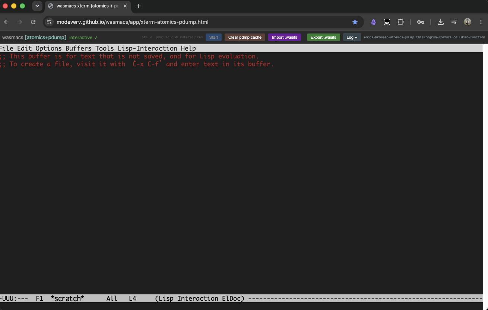
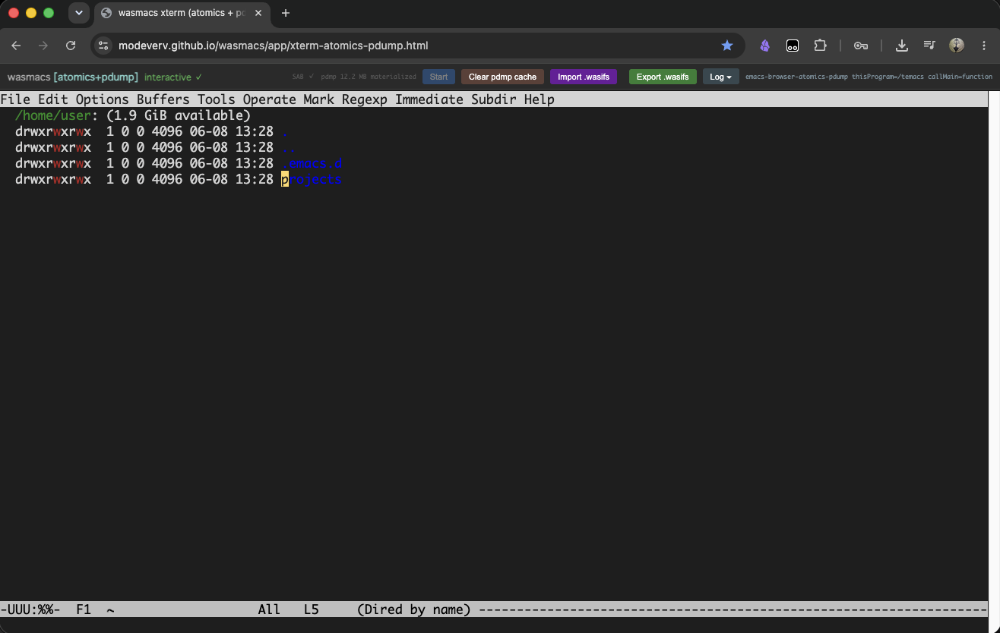
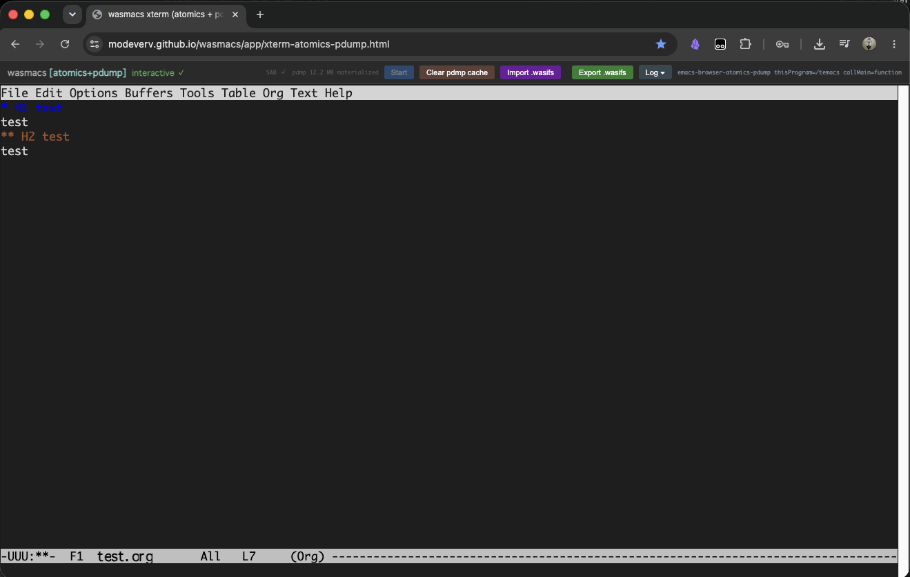
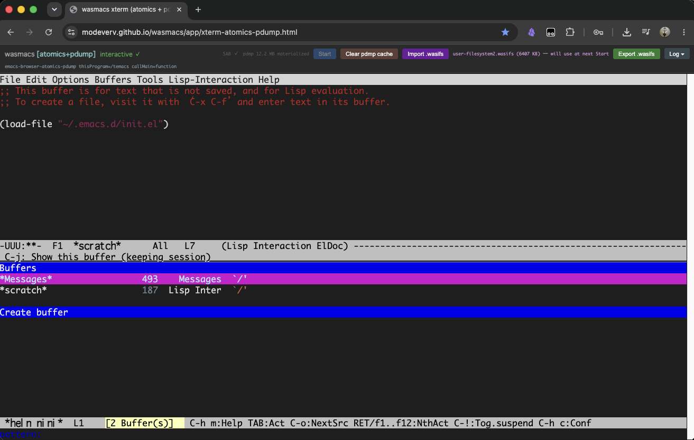

# wasmacs

`wasmacs` is a project for running GNU Emacs in the browser.

This is not a project to build an "Emacs-like editor." Its goal is to run the real Emacs on WebAssembly by keeping the GNU Emacs 30.2 C core and Elisp runtime at the center, while the browser side provides display, input, persistence, and portable filesystem images.

The current main route is the browser runtime built on `SharedArrayBuffer`, `Atomics.wait`, pdump, and xterm.js. It has reached `*scratch*`, Dired, Org mode, Elisp loading through `load-file`, and import/export of `.wasifs` images.

## Current Capabilities

- Boot the GNU Emacs 30.2 C core in the browser
- Display Emacs `--nw` through xterm.js
- Handle truecolor, control keys, cursor movement, mouse input, bracketed paste, and resizing with `TERM=xterm-256color`
- Materialize the bundled `bootstrap-emacs.pdmp` and reach the interactive waitpoint
- Import/export `user-filesystem.wasifs`
- Load Elisp from the user-side `.wasifs` image with `load-file`
- Boot from static hosting on GitHub Pages
- Route `url.el` / `package.el` HTTP(S) requests through `host.network.fetch`
- Use a user-operated self-hosted proxy for package archives that cannot be fetched directly because of CORS

## Current Limitations

- The Emacs core inside the browser does not have raw sockets or ordinary POSIX processes.
- `host.process` is unavailable.
- Emacs features that depend on external commands or subprocesses do not work as-is.
- Network features such as `package-refresh-contents` are constrained by browser fetch, CORS, and proxy configuration.
- This is not a port of native GUI Emacs frames. The current route is terminal Emacs running on xterm.js.
- Pages artifacts under `docs/` are split and constrained so they can be hosted by GitHub Pages.
- A separate build route can generate the VS Code `.wasifs` extension.

## Repository Layout

```text
src/wasm/   browser wasm app source
src/assets/ source assets copied into generated docs output
src/build/  docs and artifact generation scripts
src/c/      Emacs C-side patch layer
src/runtime/ host/runtime libraries used by tests and tools
tools/      build / validation / probe / prototype / inspection tools
tools/probs/ prototype and exploratory probe code
proxy/      self-hosted fetch proxy samples for package archives
vendor/     pinned upstream GNU Emacs source; read-only
build/      copied Emacs working tree, temporary state, and generated artifacts
build/artifacts/ generated wasm / pdmp / wasifs build products
build2/     VS Code-only copied Emacs workspace and runtime artifacts
doc/        architecture and planning notes
docs/       GitHub Pages output
vscode/     generated VS Code webview app bundle
logs/       ignored runtime logs; only .gitkeep is kept in Git
tests/      automated test code
archive/    old outputs and superseded files
```

`vendor/emacs` is the pinned upstream GNU Emacs source tree. Do not edit it directly. Experimental patches are applied to copied build trees.

## Browser App

The main development route is available at the following URL after running `npm run dev`.

```text
http://127.0.0.1:5173/app/xterm-atomics-pdump.html
```

`make docs` generates the GitHub Pages bundle. `docs/index.html` redirects `/` to the canonical app page, `/app/xterm-atomics-pdump.html`.

The Pages bundle follows these rules:

- Use the root `coi-serviceworker.js` to provide a COOP/COEP-like environment for `SharedArrayBuffer`.
- Keep app and artifact URLs relative so project pages also work.
- Publish the Emscripten glue as `temacs.js` so static servers return a JavaScript MIME type.
- Store the large Emscripten preload package as chunks under `docs/artifacts/temacs.data.parts/` instead of a single oversized `temacs.data` file.

Routine diagnostic logs are quiet by default. Append the following query parameter to enable verbose logs:

```text
?debug-log=1
```

When inspecting the page with DevTools while resizing the viewport, this query parameter keeps the post-boot terminal size stable:

```text
?no-live-resize=1
```

## Screenshots

### Startup



### Dired



### Org File



## Requirements

- Node.js 24 or newer
- npm
- Emscripten toolchain
- GNU make

xterm.js is not vendored through `node_modules`. Browser pages load it from the jsDelivr CDN. The checked-in HTML directly references `https://cdn.jsdelivr.net/npm/@xterm/xterm@5/...`.

After cloning, run:

```sh
npm ci
```

## Common Commands

```sh
make prepare
make test
make build
make vscode-build
make docs
make dev
```

`make prepare` copies `vendor/emacs` to `build/emacs-30.2-patched/src` and applies `src/c/patches/*.patch`. Do not edit `vendor/emacs` directly.

`make build` regenerates the Emacs wasm / pdmp / wasifs artifacts under `build/artifacts/`, then refreshes the GitHub Pages bundle under `docs/`.

`make dev` starts the development server. The development server exposes runtime files at `/artifacts/...`, so workers and smoke URLs use the same URL contract as Pages.

`make vscode-build` generates the separate route for the VS Code `.wasifs` extension. VS Code-only artifacts are written under `build2/artifacts/`, and the webview app bundle is written under `vscode/app/`. This route does not consume or update `docs/app` or `docs/artifacts`.

## Network Access

wasmacs treats network access as an explicit browser host capability.

The Emacs core does not receive raw sockets or `host.process` for package downloads. Instead, the checked-in `wasmacs-url-fetch` Lisp overlay routes `url.el` HTTP(S) requests through `host.network.fetch`. This lets `package-refresh-contents`, `package-install`, `use-package :ensure`, and similar features run as request/response services.

However, direct browser `fetch` is constrained by CORS. If the remote package archive does not allow the page origin, JavaScript cannot read the response body. Service Workers can help with app caching and COOP/COEP, but they cannot make an unreadable cross-origin response readable.

When an archive is blocked by CORS, users can configure a self-hosted fetch proxy under their own control. wasmacs does not provide a central proxy service.

The `proxy/` directory includes sample implementations in Node, PHP, Rust, Perl, Ruby, Python, and PowerShell. Each sample accepts the same JSON request shape as the local development `__wasmacs_network_fetch` route and returns the response status, headers, and base64-encoded response bytes.

The proxy samples are allowlist-based by default. The Ruby sample is the exception: it defaults to `*` for localhost-only development.

Specify allowed archive origins as follows:

```sh
WASMACS_PROXY_ALLOWED_ORIGINS=https://elpa.gnu.org,https://melpa.org
```

When a local proxy is running, pass it to the browser runtime with `network-proxy`:

```text
http://127.0.0.1:5173/app/xterm-atomics-pdump.html?network-proxy=http%3A%2F%2F127.0.0.1%3A8787%2F
```

The runtime first tries direct browser fetch. If CORS prevents reading the archive, it falls back to the configured proxy endpoint. On localhost development pages, it can also use the same-origin `__wasmacs_network_fetch` route provided by `make dev`. Static hosts such as GitHub Pages do not provide that route.

On the Atomics/pdump route, the worker relays `host.network.fetch` to the main page. The actual direct/proxy `fetch` runs on the main page thread, not as worker-local synchronous XHR, and the result is returned through a SharedArrayBuffer result slot.

When a public HTTPS page calls a localhost proxy, modern browsers may send a Private Network Access preflight. For that reason, the bundled proxy samples return `Access-Control-Allow-Private-Network: true` and echo the requesting `Origin` instead of using wildcard CORS.

A proxy can also be configured from Emacs Lisp for a specific user image or init flow:

```elisp
(require 'wasmacs-url-fetch)
(setq wasmacs-url-fetch-proxy-url "http://127.0.0.1:8787/")
(wasmacs-url-fetch-enable)
```

The Emacs-side `wasmacs-url-fetch-proxy-url` value is sent with each `url.el` / `package.el` request and takes precedence over the page-level `network-proxy` default.

## `.wasifs` Images

`.wasifs` files are portable filesystem images used by the browser runtime.

The current spike format is tar-compatible. A plain `tar` command can be used for low-level inspection:

```sh
tar tf user-filesystem.wasifs
```

For normal repository work, use the npm scripts:

```sh
npm run wasifs:list -- user-filesystem.wasifs
npm run wasifs:pack -- ./home-user user-filesystem.wasifs --root home/user
npm run wasifs:unpack -- user-filesystem.wasifs ./out
```

`wasifs:pack` packs a local directory under the requested image root.

- Use `--root home/user` for writable user images.
- Use `--root system` for read-only system image experiments.

`wasifs:list` and `wasifs:unpack` hide tar metadata noise such as `PaxHeader`, AppleDouble `._*`, and `.DS_Store`, so the visible tree matches the portable filesystem contents.

### Example: Importing Helm via a Packed Image



## Artifact Policy

Build outputs are generated under `build/artifacts/`.

The publishable `docs/` tree contains only the checked-in browser bundle and Pages-safe runtime artifacts. Files allowed under `docs/artifacts/` are validated by `tools/scripts/validate-git-artifact-policy.sh`.

The old 512MB pdump restore failure is not the current browser status. The current Atomics/pdump xterm route has been verified to materialize the bundled pdmp and reach the interactive waitpoint from both the development server and the static Pages bundle.

`make clean` removes legacy `dist/` if it exists and empties `build/` and `docs/`. It intentionally leaves `build2/` and `vscode/` alone so the Pages route and VS Code route can be validated independently.

Runtime and validation logs are written under `logs/`, but log files are ignored by Git. Historical logs from before the reorganization baseline are kept under `archive/old-logs/`.

`build/artifacts/host-abi.wit` is generated by `src/build/generate-host-abi-wit.mjs`. It is a build artifact, not source under `src/`. It is validated by `tools/scripts/validate-host-abi.sh`.

`dist/` is not part of the current layout.

## Architecture

wasmacs is built around three core pieces:

```text
emacs-core.wasm
system-lisp.wasifs
user-filesystem.wasifs
```

`emacs-core.wasm` contains the GNU Emacs C core, Elisp interpreter, bytecode runtime, and built-in primitives.

`system-lisp.wasifs` is a read-only image tied to a fixed Emacs release. It contains GNU Emacs `lisp/`, `.el` files, `.elc` files, autoload/loaddefs artifacts, and `etc/` support files.

`user-filesystem.wasifs` is a writable portable image. It contains `init.el`, ELPA packages, site-lisp, working files, and journal/snapshot metadata.

The intended mount layout at startup is:

```text
/system    read-only
/home/user writable
/tmp       volatile
```

`load-path` gives the user image priority over the system image:

```text
/home/user/.emacs.d/lisp
/home/user/.emacs.d/elpa/*/
/system/lisp
```

This design separates the update cycles of the Emacs runtime, the standard Lisp distribution, and the user's workspace.

Before changing runtime ownership boundaries or C/wasm host surfaces, read:

```text
ARCHITECTURE.md
PLAN.md
doc/small-os-for-emacs.md
```

## Design Principles

- The Emacs core owns editor semantics.
- The browser UI is a display/input host; it must not fake undo, kill-ring, region, minibuffer, or file-visiting semantics.
- `.wasifs` is the unit of portable workspaces.
- `vendor/emacs` is read-only.
- Processes, ptys, and sockets are treated as explicit unavailable boundaries in the MVP.
- Product behavior and diagnostic behavior are kept separate.
- The low-level substrate is C/wasm-first. JavaScript remains the browser coordinator, host capability provider, and diagnostic harness.

## In Development: VS Code `.wasifs` Extension

The VS Code `.wasifs` extension is a separate lane from the Pages bundle.

```sh
make vscode-build
```

This command generates VS Code-only runtime artifacts under `build2/artifacts/` and the webview app bundle under `vscode/app/`. It does not update `docs/app` or `docs/artifacts`.

This keeps the GitHub Pages browser app and the VS Code webview extension experiment coexisting in the same repository while keeping artifact ownership separate.

## Development Notes

This project is not only a browser port of Emacs. It is also an attempt to provide, inside the browser, the small compatibility OS that Emacs expects.

The important part is not to accumulate ad-hoc shims, but to organize the lifecycle, memory/root safety, control flow, blocking input, filesystem/persistence, preloaded state, host capabilities, and browser GUI boundary that Emacs requires.

When changing runtime ownership boundaries or C/wasm host surfaces, do not just add a patch that happens to work. Make clear which service and which invariant the change satisfies.
